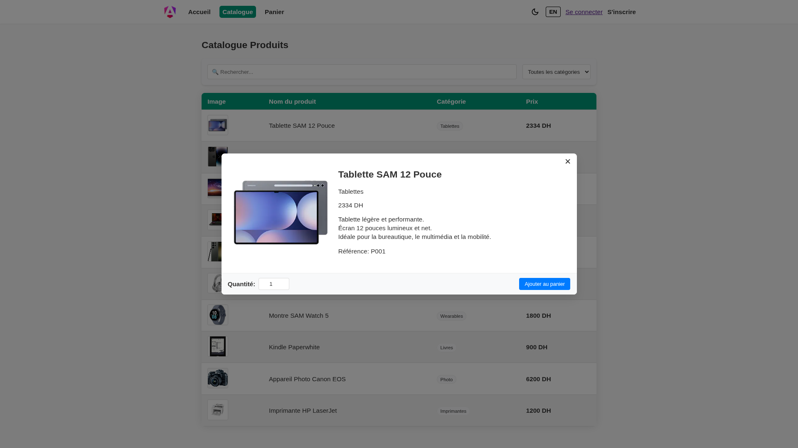
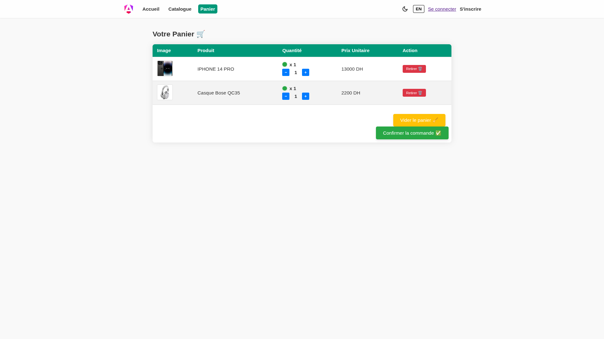
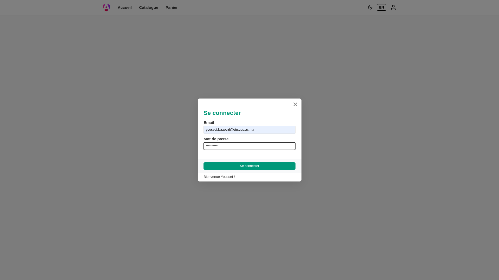
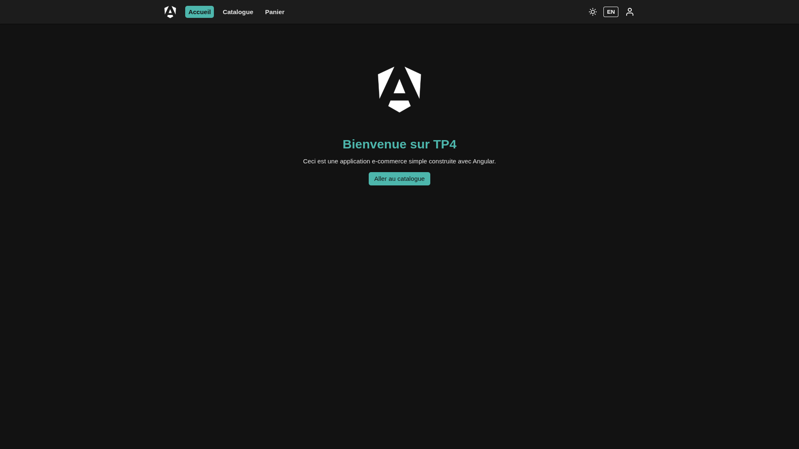
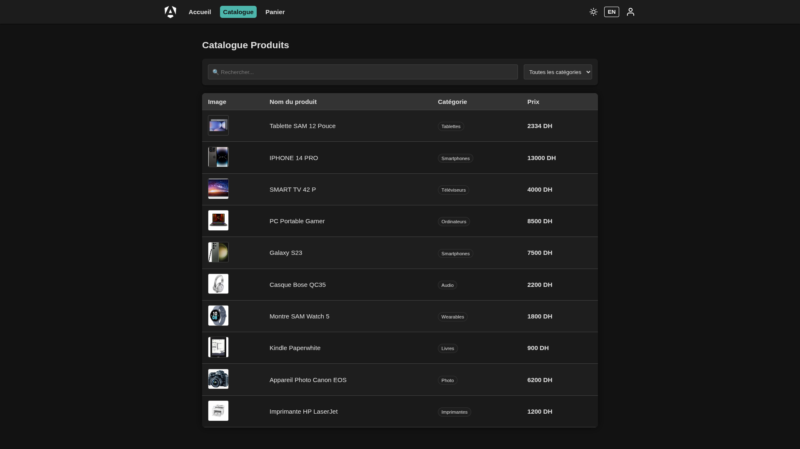
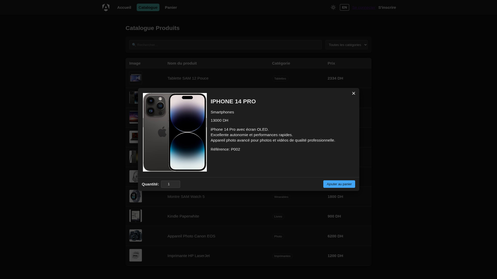
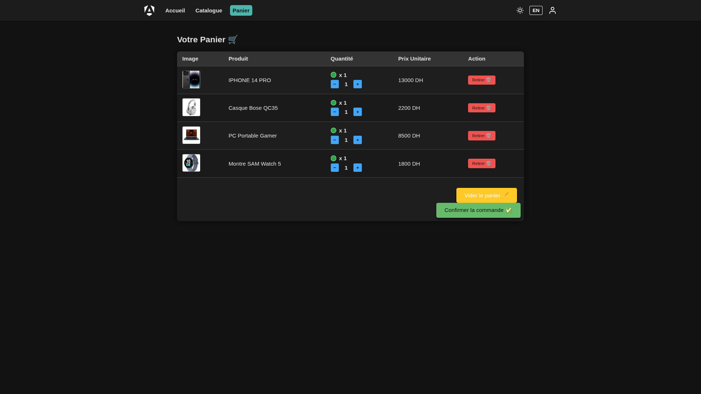
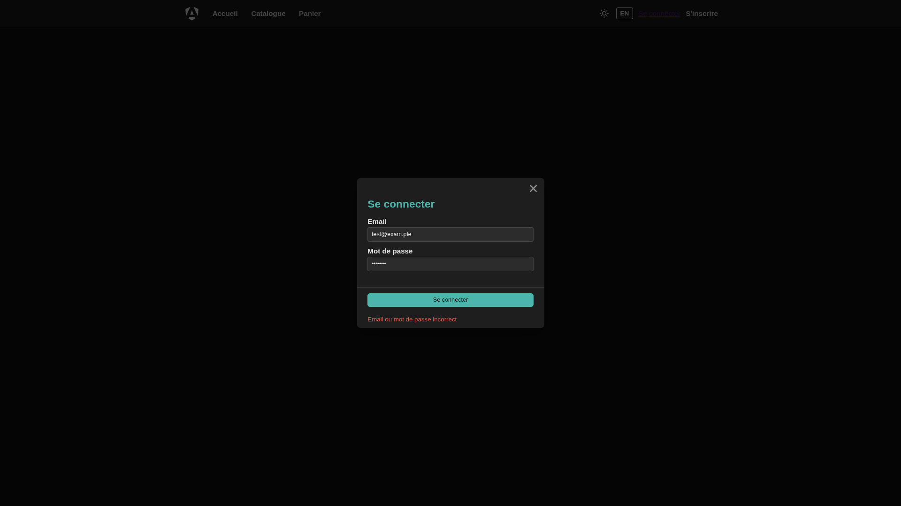

# TP4 Angular : Application E-Commerce Full Stack & Multilingue

**Université Abdelmalek Essaâdi** | **Faculté Polydisciplinaire - Larache**  
**Module :** Programmation Full Stack  
**Professeur :** M. KOUISSI Mohamed  
**Année Universitaire :** 2025/2026

---

## 📝 Description du Projet

Application e-commerce avancée développée en **Angular 21** intégrant un backend **Express.js**, un support complet du **mode sombre**, une internationalisation (**i18n**) et une architecture réactive basée sur les **Observables**.

**Dernière mise à jour :** 2025-12-20. Intégration API réelle, Dark Mode unifié, support multilingue (FR/EN) et nettoyage complet du code.

---

## 🎯 Fonctionnalités Principales

### 🌓 Mode Sombre Unifié
- **Thématisation complète** via variables CSS natives.
- **Persistance du choix** dans le `localStorage`.
- **Icônes monocolores** (SVG) qui s'inversent (Noir/Blanc) selon le thème.
- **Logos dynamiques** : Version dégradée pour le mode clair, version blanche pour le mode sombre.

### 🌍 Support Multilingue (i18n)
- **Internationalisation complète** avec `@ngx-translate`.
- **Langues supportées** : Français (FR) et Anglais (EN).
- **Traduction dynamique** des catégories, messages d'erreur, et interfaces.
- **Persistance de la langue** préférée.

### 📡 Intégration API Réelle
- **Migration des données** : Les produits ne sont plus statiques mais récupérés via un serveur API Node.js.
- **Authentification réelle** : Système de Sign-In via POST API avec gestion des erreurs et états de chargement.
- **Gestion asynchrone** : Utilisation intensive de `HttpClient` et RxJS.

### ✅ Catalogue Produits
- **Récupération dynamique** via `/api/products`.
- **Recherche et filtrage** instantanés.
- **Traduction des catégories** (Tablettes, Smartphones, etc.).
- **États de chargement** et gestion des erreurs de connexion.

### 🛒 Panier & Modal
- **Gestion réactive** des quantités.
- **Badges colorés** par unité.
- **Modal de détails** avec images haute qualité et descriptions traduites.

---

## 🛠️ Architecture Technique

### Structure du Projet
```
/
├── api-server/                # Serveur Express.js (Port 3001)
│   └── index.js               # Endpoints : /api/signin, /api/products
│
├── src/app/
│   ├── models/                # Modèles de données (Product, User, Cart)
│   ├── services/              # Services (LoginService, ProductService, CartService)
│   ├── components/            # Composants Standalone
│   ├── assets/
│   │   ├── i18n/              # Fichiers de traduction (en.json, fr.json)
│   │   ├── icons/             # Icônes SVG monocolores
│   │   └── images/            # Assets graphiques (PNG logos)
│   └── app.config.ts          # Config HttpClient (fetch) et TranslateModule
```

### Technologies Utilisées
- **Angular 21** (Standalone, Signals, Block control flow)
- **@ngx-translate** (Internationalisation)
- **Express.js 5.x** (Backend API & CORS)
- **Node.js 25.x** (LTS compatible)
- **RxJS** (Gestion des flux asynchrones)
- **CSS Variables** (Thématisation dynamique)

---

## 🚀 Installation & Démarrage

### 1. Installation
```bash
git clone https://github.com/LazzouziYoussefEtu/TP_Angular_WebFullStack.git
cd TP_Angular_WebFullStack

# Frontend
npm install

# Backend
cd api-server
npm install
cd ..
```

### 2. Lancer le Projet
Il est impératif de lancer le serveur API pour que les produits et la connexion fonctionnent.

```bash
# Terminal 1 : API Server
cd api-server && npm start

# Terminal 2 : Angular App
npm start
```
L'application est disponible sur **http://localhost:4200**.

---

## 🔑 Identifiants de Test
- **Email :** `youssef.lazzouzi@etu.uae.ac.ma`
- **Mot de passe :** `password123`

---

## 📸 Captures d'écran

### ☀️ Mode Clair (Light Mode)
Organisé dans le dossier `screenshots/light-mode/`

| Accueil | Catalogue |
| :---: | :---: |
|  |  |

| Détails Produit | Panier |
| :---: | :---: |
|  |  |

| Connexion Réussie |
| :---: |
|  |

### 🌙 Mode Sombre (Dark Mode)
Organisé dans le dossier `screenshots/dark-mode/`

| Accueil | Catalogue |
| :---: | :---: |
|  |  |

| Détails Produit | Panier |
| :---: | :---: |
|  |  |

| Erreur Connexion |
| :---: |
|  |

---

## 👨‍💻 Auteur

**Youssef Lazzouzi**  
Étudiant - SMI-0211/23  
Filière : Licence Développement Informatique et Méthodes DevOps

---

## 📄 Licence
Travail académique - Université Abdelmalek Essaâdi.
